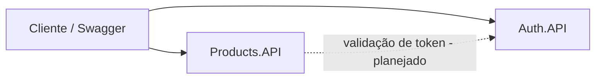

# Marketplace.Microservices

Projeto de estudo que separa um marketplace, originalmente monolítico, em microsserviços independentes com .NET 8, executados em containers Docker.

O objetivo é praticar arquitetura de microsserviços de ponta a ponta: divisão por responsabilidade, empacotamento em imagens Docker, orquestração com Docker Compose e análise de segurança das imagens.

## Status do projeto

| Serviço | Responsabilidade | Situação |
|---|---|---|
| Auth.API | Cadastro e autenticação de usuários | Implementação inicial concluída e containerizada |
| Products.API | Catálogo de produtos | Em desenvolvimento |

## Arquitetura



Cada serviço é um projeto independente, com seu próprio Dockerfile e, futuramente, seu próprio banco de dados. Nenhum serviço acessa diretamente os dados do outro.

## Tecnologias

- .NET 8 e ASP.NET Core Web API (controllers)
- Swagger / OpenAPI (Swashbuckle.AspNetCore 6.6.2)
- Docker (build multi-stage)

## Estrutura do repositório

```
Marketplace.Microservices/
├── Auth.API/
│   ├── Controllers/
│   │   └── AuthController.cs
│   ├── Program.cs
│   ├── Auth.API.csproj
│   ├── appsettings.json
│   ├── Dockerfile
│   └── .dockerignore
├── Products.API/
│   ├── Controllers/
│   │   └── ProductsController.cs
│   ├── Program.cs
│   ├── Products.API.csproj
│   └── appsettings.json
├── .gitignore
└── README.md
```

## Como executar

### Com Docker (Auth.API)

Pré-requisito: Docker instalado.

Todos os comandos abaixo devem ser executados dentro da pasta `Auth.API`.

Construir a imagem:

```bash
docker build -t auth-api:1.3 .
```

Criar e iniciar o container:

```bash
docker run -d --name auth-api -p 5001:8080 auth-api:1.3
```

A opção `-p 5001:8080` publica a porta 8080 do container (onde a API escuta) na porta 5001 da máquina local.

Acessar o Swagger em: http://localhost:5001/swagger

Comandos do dia a dia:

```bash
docker stop auth-api      # desligar
docker start auth-api     # ligar novamente (reaproveita o container e a porta)
docker logs auth-api      # consultar os logs
docker rm -f auth-api     # remover o container
```

### Localmente (sem Docker)

Pré-requisito: SDK do .NET 8.

```bash
cd Auth.API
dotnet run --urls http://localhost:5245
```

```bash
cd Products.API
dotnet run --urls http://localhost:5250
```

O Swagger de cada serviço fica disponível em `/swagger` na respectiva porta.

## Auth.API

| Método | Rota | Descrição | Respostas |
|---|---|---|---|
| GET | `/` | Verificação de disponibilidade do serviço | 200 |
| POST | `/api/auth/register` | Cadastra um usuário | 200, 409 (e-mail já cadastrado) |
| POST | `/api/auth/login` | Autentica e retorna um token | 200, 401 (credenciais inválidas) |

Corpo das requisições de cadastro e login:

```json
{
  "email": "usuario@exemplo.com",
  "password": "123456"
}
```

Como os usuários são armazenados em memória, é necessário cadastrar um usuário com `register` antes de realizar o `login`.

## Decisões e observações técnicas

**Dockerfile multi-stage.** O primeiro estágio usa a imagem do SDK do .NET apenas para compilar e publicar. O estágio final usa a imagem do runtime ASP.NET, que contém somente o necessário para executar a aplicação, resultando em uma imagem menor.

**Aproveitamento de cache.** O arquivo `.csproj` é copiado e restaurado antes do restante do código. Assim, o Docker reaproveita a camada de restauração de pacotes quando apenas o código C# é alterado.

**Arquivo `.dockerignore`.** Impede que as pastas locais `bin/` e `obj/` sejam enviadas ao build. Sem ele, o arquivo `obj/project.assets.json` da máquina local sobrescreve o gerado dentro da imagem e a publicação falha.

**Porta definida pelo ambiente.** O código não fixa endereço nem porta. No container, a imagem base do ASP.NET escuta na porta 8080; localmente, a porta é informada por `--urls`. O mesmo código funciona nos dois cenários.

**Swagger habilitado em qualquer ambiente.** Escolha feita para facilitar a demonstração. Em produção, o recomendado é restringi-lo ao ambiente de desenvolvimento.

**Limitações conhecidas desta etapa:**

- Os dados ficam em memória e são perdidos quando o container é reiniciado ou removido.
- As senhas estão em texto puro.
- O token retornado no login é um identificador de demonstração, não um JWT.

Esses pontos serão resolvidos nas próximas etapas.

## Roadmap

- [x] Estrutura inicial dos dois serviços
- [x] Endpoints de cadastro e login no Auth.API
- [x] Documentação com Swagger
- [x] Dockerfile multi-stage do Auth.API
- [ ] Imagem e container do Products.API
- [ ] Docker Compose com os serviços na mesma rede
- [ ] Banco de dados separado por serviço, com volume persistente
- [ ] Autenticação com JWT e senhas com hash
- [ ] Comunicação HTTP entre Products.API e Auth.API
- [ ] Análise de vulnerabilidades das imagens com Trivy
- [ ] Publicação das imagens em um registry (Amazon ECR)

## Autor

Gustavo Silva Tiano

Projeto desenvolvido durante a Pós-Graduação em Arquitetura de Sistemas .NET (FIAP).
